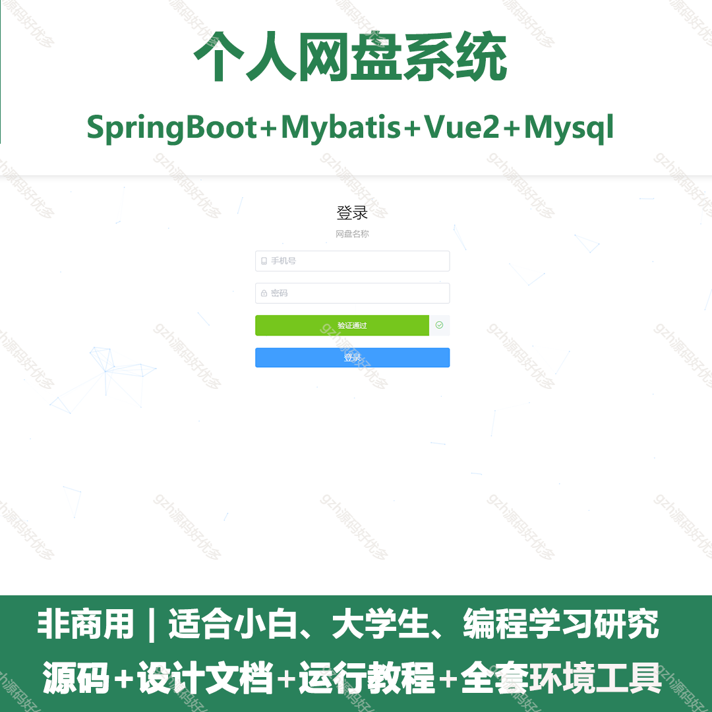
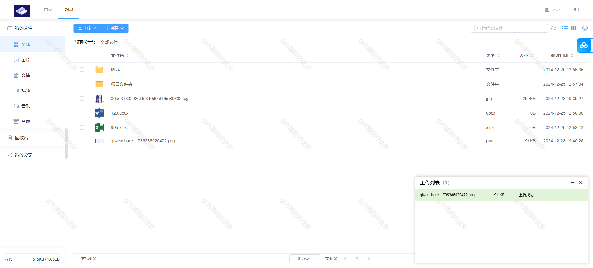
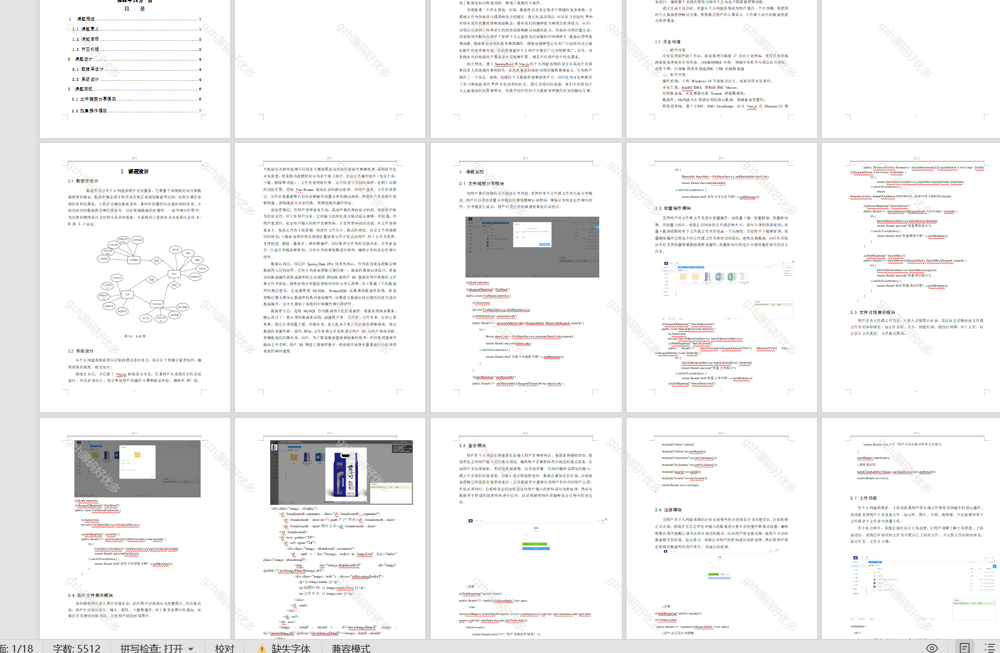
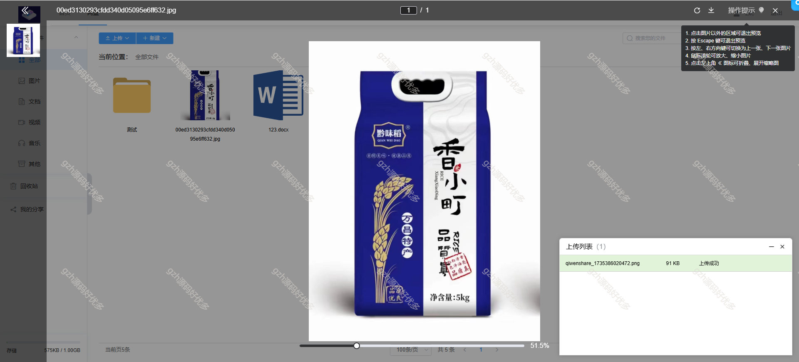
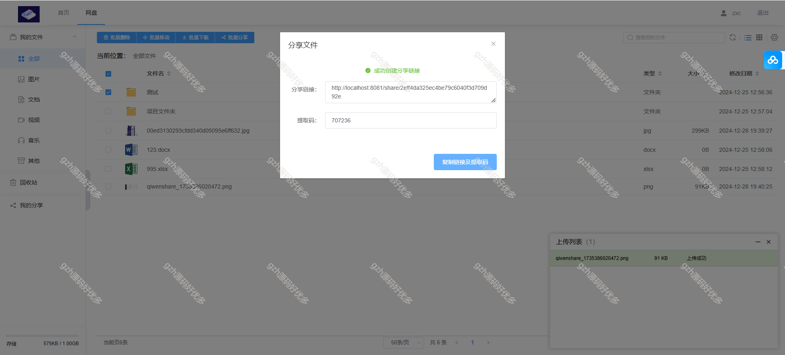
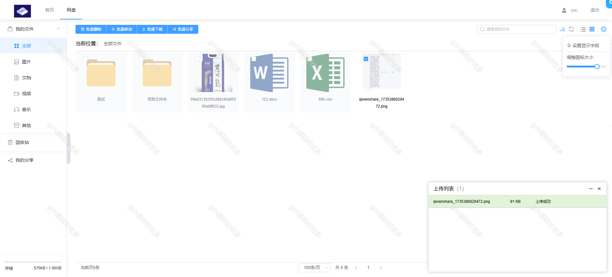
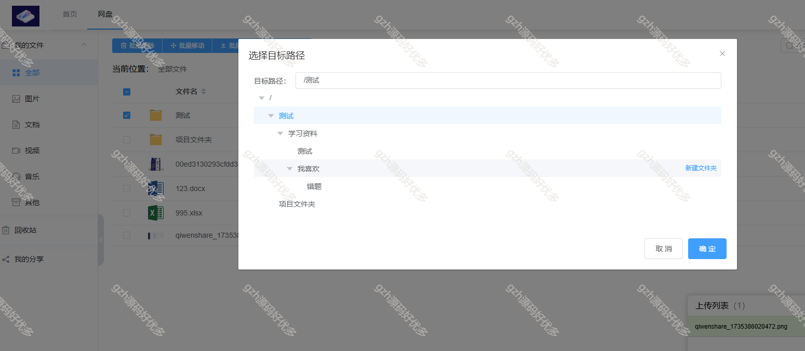
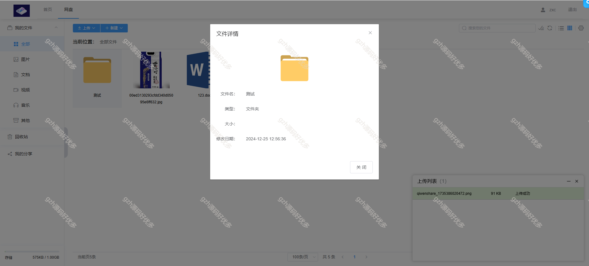

# springbootA503
springbootA503个人网盘系统
 
## 查看主页获取源码

### 一、关键词

网盘系统，个人网盘系统

 

### 二、作品包含

源码+数据库+设计文档+全套环境和工具资源+部署教程

 

### 三、项目技术

前端技术： vue2 Element-ui Axios 
后端技术：Java、Mysql、SpringBoot2.0、Mybatis

  

 

### 四、运行环境（以下版本亲测，其他版本未知，请自测）

开发工具：IDEA/eclipse  + VSCODE

数据库：MySQL8

数据库管理工具：Navicat10以上版本

环境配置软件： JDK1.8 + Maven3.6.3

前端Nodejs：16

浏览器：谷歌浏览器

 

### 五、项目介绍

项目编号：springbootA503

该系统旨在为用户提供一个安全、高效、便捷的个人数据存储和管理平台，满足数字化时代用户对个人数据管理的需

【功能模块】
我的文件、我的分享、存储、批量操作、文件预览、注册、登录等等功能

 

### 六、运行截图

